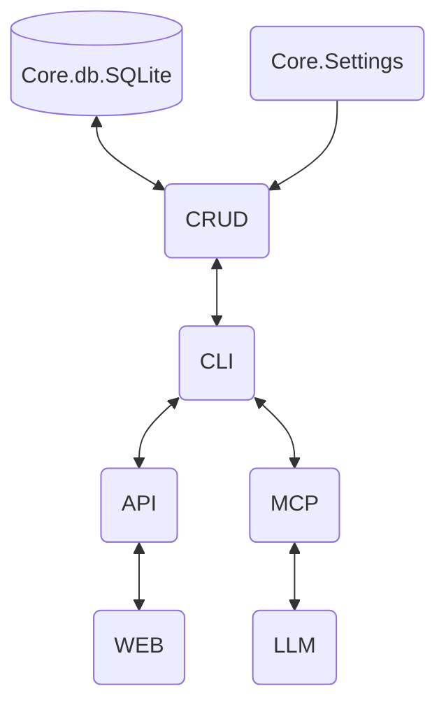
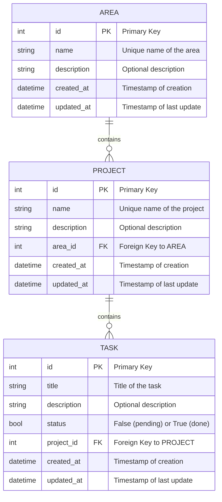

# Welcome to Todo Tracker Documentation

This is the main documentation for the Todo Tracker project.
Navigate through the sections to learn more about how interact with todo-tracker using CLI, API and MCP

Here's the high-level architecture of the library

And here's how todos are being stored in the database

